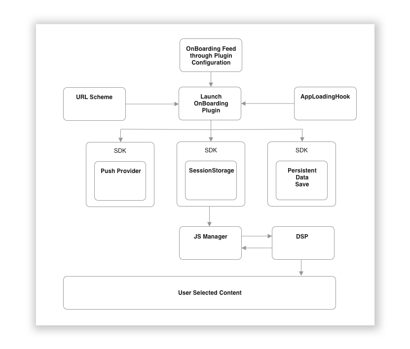
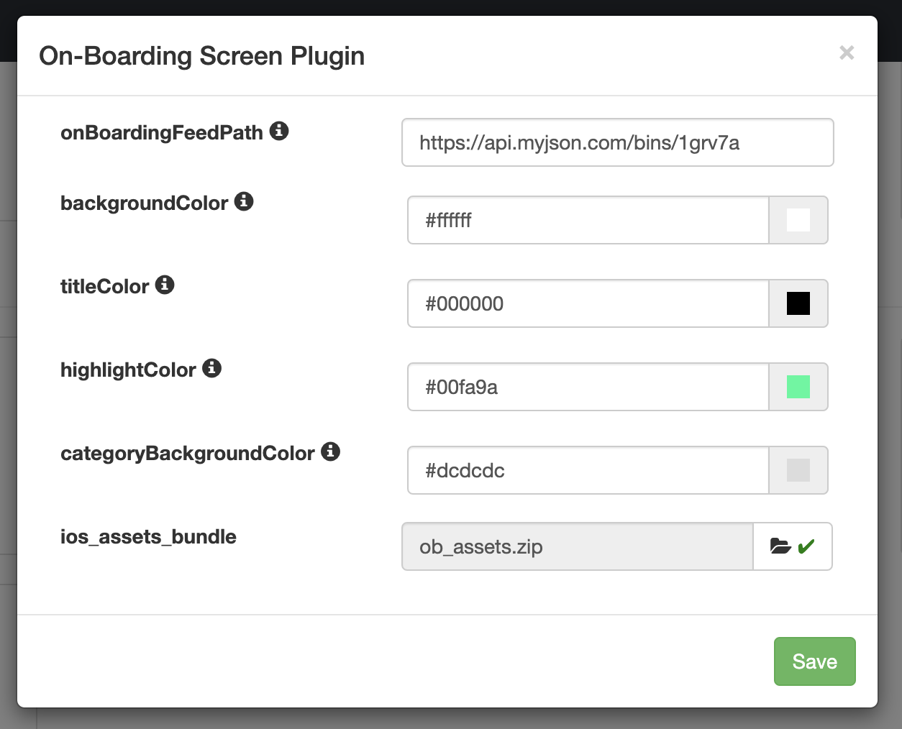
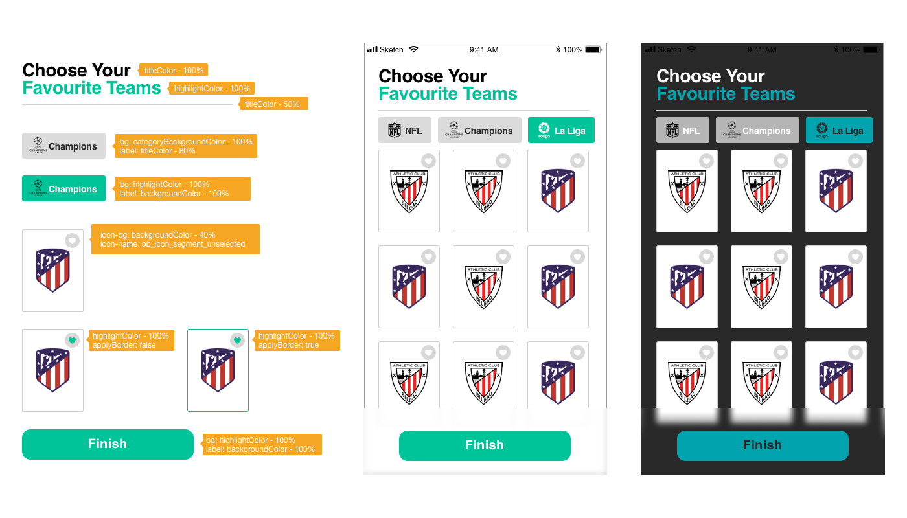

# On Boarding Loading Hook Screen Plugin for Android
On Boarding Loading Hook Screen Plugin that uses SessionStorage and PresistentStore to store user preferences. This plugin needs a JSON feed to display the different options to the user. 

This plugin also registers user for PushNotifications tags if a PushProvider is configured. This plugin uses the ISO 639-1 language code to ensure tailored content and push notifications are sent in device's locale.


### Change History
`1.0.0` - April 30, 2019 - Created by LATAM team


### Point of contact
Name  | Email
------------- | -------------
Javier Casaudoumecq  | j.casaudoumecq@applicaster.com
Marcos J. Reyes  | m.reyes@applicaster.com

***
**Table of contents**

* [Structure of onBoardingFeed](#on-boarding-flow-diagram)
* [Minimum Requirements](#minimum-requirements)
* [Structure of onBoardingFeed](#structure-on-boarding-feed)
* [Plugin Configuration](#plugin-configuration)
* [Plugin Configuration - Visual Aid](#configuration-visual-aid)
* [Launching through URL Scheme](#launching-through-url)

***

## <a name="on-boarding-flow-diagram"></a>OnBoarding Flow Diagram


## <a name="minimum-requirements"></a>Minimum Requirements
Minimum Zapp-SDK: `8.3.0-preview1`

## <a name="structure-on-boarding-feed"></a>Structure of onBoardingFeed
There are 2 different general scenarios for the onBoardingFeed.
 
1. You have only ONE main category with many segments inside.
1. You have many Categories with many segments inside each.

Both of these feed samples are shown below as well as how the plugin will look with such feeds.

### Important keys in the onBoardingFeed.json
`languages`: an array of the available languages

`onboardingTexts`: dictionary containing dictionaries that specify the texts to display during on boarding experience. These texts must also be available in all languages defined in `languages` array. `onboardingTexts` must contain the following keys: `title`, `subtitle`, `skipOnboarding`, `finishOnboarding`

`categories`: this is an array of dictionaries containing the category titles as well as the segments inside each category. Look at the sample feed below to structure your onBoardingFeed properly.

### onBoardingFeed.json (single category)
```
{
	"languages": [
		"en",
		"es",
		"pt"
	],
	"onboardingTexts": {
		"title": {
			"es": "Escoge tu",
			"en": "Choose Your",
			"pt": "Escolha o seu"
		},
		"subtitle": {
			"es": "Equipo favorito",
			"en": "Favorite Team",
			"pt": "Time Favorito"
		},
		"skipOnboarding": {
			"es": "Elegir después",
			"en": "Choose Later",
			"pt": "Escolher depois"
		},
		"finishOnboarding": {
			"es": "Listo",
			"en": "Finish",
			"pt": "Terminar"
		}
	},
	"categories": [{
		"title": {
			"es": "Copa America",
			"en": "Copa America",
			"pt": "Copa America"
		},
		"id": "32424234",
		"imageUrl": "http://copaamerica.com/static/PAR-b2d96f3bde8b57ed982105ee6e332255.jpg",
		"segments": [{
				"title": {
					"es": "Argentina",
					"en": "Argentina",
					"pt": "Argentina"
				},
				"id": "1001",
				"imageUrl": "http://copaamerica.com/static/VEN-c4cf24aaf0312f622387a60fd730a725.jpg"
			},
			{
				"title": {
					"es": "Bolivia",
					"en": "Bolivia",
					"pt": "Bolivia"
				},
				"id": "1002",
				"imageUrl": "http://copaamerica.com/static/PAR-b2d96f3bde8b57ed982105ee6e332255.jpg"
			},
			{
				"title": {
					"es": "Brasil",
					"en": "Brasil",
					"pt": "Brasil"
				},
				"id": "1003",
				"imageUrl": "http://copaamerica.com/static/VEN-c4cf24aaf0312f622387a60fd730a725.jpg"
			}
		]
	}]
}
```

### onBoardingFeed.json (multiple categories)
```
{
    "languages": [
        "en",
        "es",
        "pt"
    ],
    "onboardingTexts": {
        "title": {
            "es": "Escoge tu",
            "en": "Choose Your",
            "pt": "Escolha o seu"
        },
        "subtitle": {
            "es": "Equipo favorito",
            "en": "Favorite Team",
            "pt": "Time Favorito"
        },
        "skipOnboarding": {
            "es": "Elegir después",
            "en": "Choose Later",
            "pt": "Escolher depois"
        },
        "finishOnboarding": {
            "es": "Listo",
            "en": "Finish",
            "pt": "Terminar"
        }
    },
    "categories": [
        {
            "title": {
                "es": "Copa America",
                "en": "Copa America",
                "pt": "Copa America"
            },
            "id": "32424234",
            "imageUrl": "http://copaamerica.com/static/PAR-b2d96f3bde8b57ed982105ee6e332255.jpg",
            "segments": [
                {
                    "title": {
                        "es": "Argentina",
                        "en": "Argentina",
                        "pt": "Argentina"
                    },
                    "id": "1001",
                    "imageUrl": "http://copaamerica.com/static/VEN-c4cf24aaf0312f622387a60fd730a725.jpg"
                },
                {
                    "title": {
                        "es": "Bolivia",
                        "en": "Bolivia",
                        "pt": "Bolivia"
                    },
                    "id": "1002",
                    "imageUrl": "http://copaamerica.com/static/PAR-b2d96f3bde8b57ed982105ee6e332255.jpg"
                },
                {
                    "title": {
                        "es": "Brasil",
                        "en": "Brasil",
                        "pt": "Brasil"
                    },
                    "id": "1003",
                    "imageUrl": "http://copaamerica.com/static/VEN-c4cf24aaf0312f622387a60fd730a725.jpg"
                }
            ]
        },
        {
            "title": {
                "es": "La liga de campeones",
                "en": "The Champions League",
                "pt": "Liga dos Campeões"
            },
            "id": "32424234abc",
            "imageUrl": "http://copaamerica.com/static/BRA-d8b045bd0d3a077fb0ee2fcc2280c8d3.jpg",
            "segments": [
                {
                    "title": {
                        "es": "Barcelona",
                        "en": "Barcelona",
                        "pt": "Barcelona"
                    },
                    "id": "1001asd",
                    "imageUrl": "http://copaamerica.com/static/ARG-87363d8f85b6ec8bccfaa03fb0ac0060.jpg"
                },
                {
                    "title": {
                        "es": "Real Madrid",
                        "en": "Real Madrid",
                        "pt": "Real Madrid"
                    },
                    "id": "1002asdf",
                    "imageUrl": "http://copaamerica.com/static/BOL-7c4fb47e1c47807336d383f0936b14f4.jpg"
                },
                {
                    "title": {
                        "es": "Ajax",
                        "en": "Ajax",
                        "pt": "Ajax"
                    },
                    "id": "1003asdf",
                    "imageUrl": "http://copaamerica.com/static/BRA-d8b045bd0d3a077fb0ee2fcc2280c8d3.jpg"
                }
            ]
        }
    ]
}
```

## <a name="plugin-configuration"></a>Plugin Configuration
The look and feel of this plugin can easily be updated to match your desired branding, inlcuding colors, icons and images.
These are the parameters that are configurable (you can find a screenshot further below outlining what each parameter and each asset represent):

`onBoardingFeedPath`: this is the URL path to the OnBoarding feed that MUST be in the format outlined above.

`backgroundColor`: background color of all plugin screens

`titleColor`: color to be used in main title label and in unselected category labels.

`highlightColor`: highlight color to be used in subtitle label, main action button and selected segments.

`categoryBackgroundColor`: background color to be used in category items.

`applyBorder`: If enabled, a border is applied to selected segments. Using the highlight color.

`android_assets_bundle`: .zip file containing required assets for Plugin. Folder must contain:

```
WIP

```


## <a name="configuration-visual-aid"></a>Plugin Configuration - Visually




## <a name="launching-through-url"></a>Launching through URLScheme
In order to launch the OnBoarding through a URL Scheme, for example, if you want to launch it from your "Settings" screen, use the `ob_preferences` action:
`<urlScheme>://plugin?type=general&action=ob_preferences`


