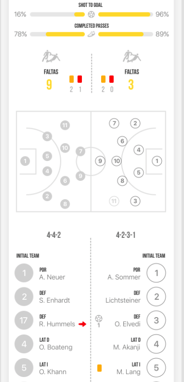

# Opta Stats

*Built by LATAM Team*

**Supports:** *iOS and Android*
*Current Version: 0.2.22 (Android), 1.0.52 (iOS)*

## About
The Opta Statistic Plugin is being developed primarily to show the statistics for Copa America 2019 tournament. Since Opta is the main provider for several events in LATAM we are pivoting this plugin to be general.

## URL Schemes supported
We defined a set of pre-configured number of screens which you can open through a URL scheme from anywhere in the application. In order to do so, we need to define a well-known URL schema. These are the proposed schemas for this integration.

### URL Scheme to open a screen
`<app_schema_id>://plugin?type=general&action=stats_open_screen&screen_id=<screen_id>&<other_data_key>=<other_data_value>`

- `<app_schema_id>` **(Required)**: Application scheme id.
- `<screen_id>` **(Required)**: A predefined `<screen_id>` from one of the following options:
-- `home_screen`
-- `match_details_screen`
-- `all_matches_screen`
-- `all_teams_screen`
-- `team_screen`
-- `player_screen`
- `<other_data_key>` **(Required for specific screens)**: To show values from a specific entity:
-- `match_id=<op_id>&push=<true_or_false>`
-- `team_id` (`team_screen` and `all_matches_screen`)
-- `player_id` (`player_screen`)

#### Match details & Push option
When opening match details screen through URL scheme, there is another key named push where indicates if the URL scheme comes from the push or if it’s being opened through the regular way.

When the url scheme is coming from push the `match_id` is different from the one provided by Opta. Let's call this data, `match_id_from_push`. With this id provided by the push is necessary to send to Opta API as `match_id`, `urn:perform:opta:fixture:<match_id_from_push>`. The id coming from the push may have a letter at the beginning. It is necessary to remove this letter to use it as `match_id` in the API call.

## Available screens
The list of screen available in the integration will be the following:
- [Home screen](#home-screen)
- [Match Details Screen](#match-details-screen)
- [All Matches Screen](#all-matches-screen)
- [Team Screen](#team-screen)
- [Player Screen](#player-screen)

###  Home screen
You can find the whole design [here](https://app.zeplin.io/project/5c8863d4039b9f39096d453d/screen/5c8864178bd661197ccb8c82).

###  Match Details Screen
You can find the whole design [here](https://app.zeplin.io/project/5c8863d4039b9f39096d453d/screen/5c88641af85b69045c2eafca).

  

###  All Matches Screen
You can find the whole design [here](https://app.zeplin.io/project/5c8863d4039b9f39096d453d/screen/5c886418988ef419824d583b).

###  Team Screen
You can find the whole design [here](https://app.zeplin.io/project/5c8863d4039b9f39096d453d/screen/5caf607f225f00a04b00e1d2).

###  Player Screen
You can find the whole design [here](https://app.zeplin.io/project/5c8863d4039b9f39096d453d/screen/5cab7ce9e89d3f338980bcb3).

## Plugin configuration
In order to make this plugin general and that can be used for other tournaments, we define the following parameters:

`token`: Token to access the information provided by Opta
`referer`: Domain(s) the client provided to Opta to allow access to its API’s
`competition_id`: Competition id of the tournament
`calendar_id`: Calendar id of the tournament
`image_base_url`: URL where the plugin get the images
`show_team`: Parameter to show rooster or not, in case the client doesn’t want to show the rooster yet.
`number_of_matches`: Number of matches that will be shown in the home carousel.

### How to configure the plugin
In Zapp Builder, go to the screen plugin, and in the right panel, you will see the fields to be filled.

